# Superdraft AI Toolkit for WordPress

Superdraft is a free WordPress plugin that enhances your content creation workflow with AI-powered tools. It seamlessly integrates into the WordPress interface to provide intelligent content suggestions, writing assistance, and automated content organization features.

- AI-powered writing assistance and recommendations
- Intelligent tag and category management
- Smart autocomplete for faster content creation
- AI-powered image generation and editing
- Support for many AI models, including free options
- Comprehensive logging and customization options

---

## Plugin Highlights

- **Free and Open Source**: No ads, no account required – community contributions are welcome
- **BYOK (Bring Your Own Key)**: Use your own API key from your AI provider of choice
- **Flexible AI Models**: Compatible with *all* AI models, including fine-tuned and locally hosted models
- **Feature-Specific Models**: Set different AI models for each functionality to optimize performance and cost
- **Multilingual**: Fully translatable, including plugin interface and AI prompts

## Features

### AI-Generated Tags & Categories

Suggests new tags and categories based on your content, and automatically chooses the right tags and categories for your posts.

This feature also works in **bulk edit** mode: select multiple posts and let Superdraft set tags and categories for all of them in a background process. To avoid API rate limits, bulk processing is done with a delay between each post, which can be adjusted with the `superdraft_bulk_process_interval` filter (see the *Action and Filter Hooks* section below).

Features include:

- Analyze existing posts to suggest relevant tags and categories
- Customize the number of suggestions
- Adjust context length for better accuracy

<details>
<summary>View Screenshots</summary>

*AI-generated tags and categories based on your content:*

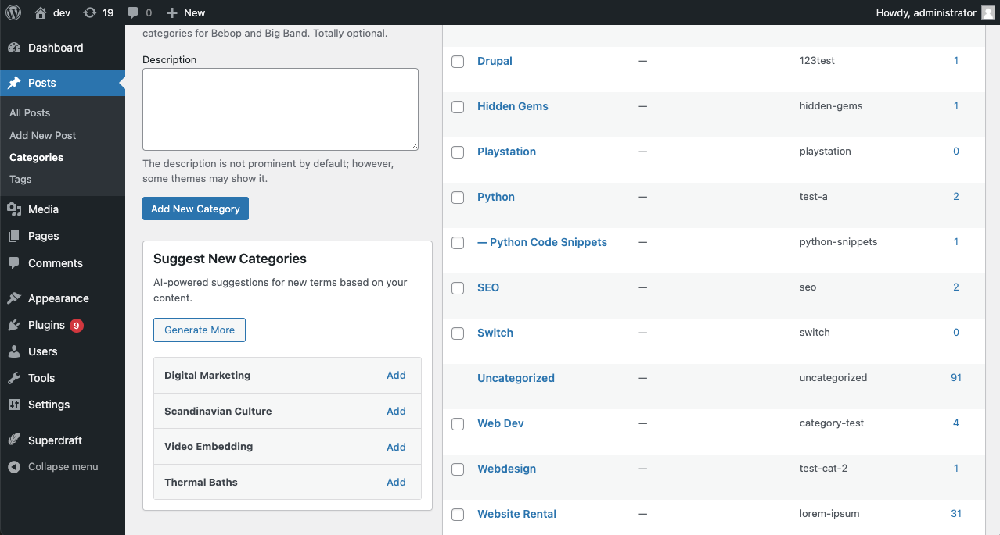

*Bulk edit mode for setting tags and categories for multiple posts:*

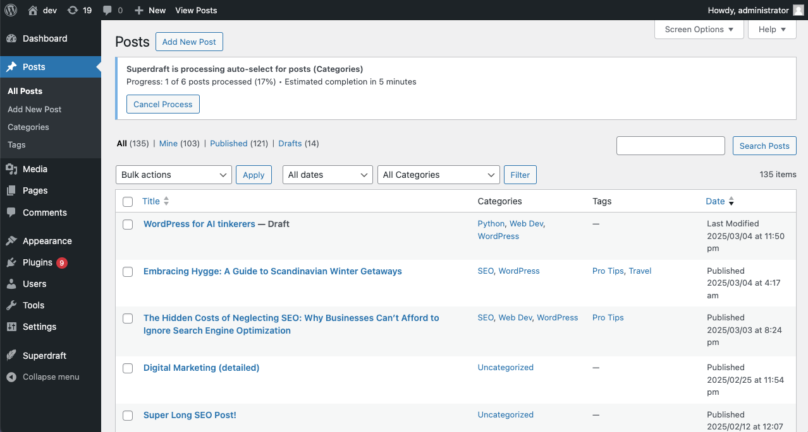

*Automatically assign tags and categories to your posts in the post editor:*

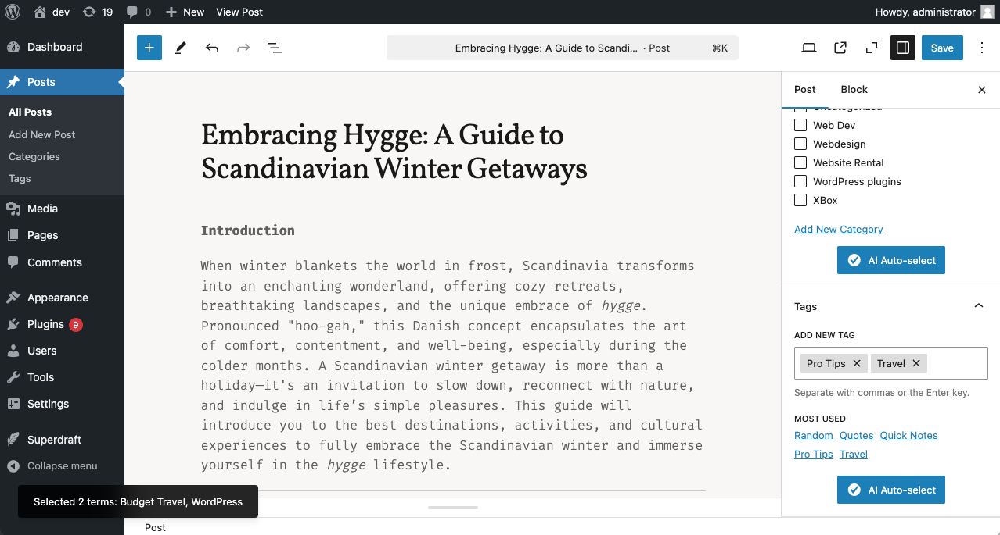

*Settings page for configuring the AI model and other options:*

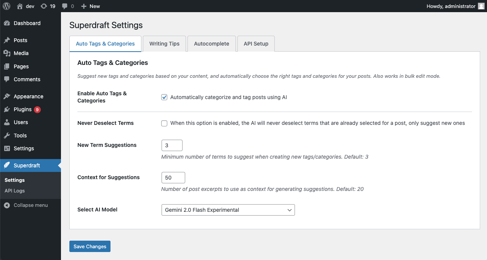

</details>

### AI Topic & Writing Recommendations

Get real-time writing assistance and content improvement tips directly in your editor sidebar. Features include:

- Writing tips and topic suggestions based on your content
- Automatically updates as you write
- SEO advice and content improvement tips

<details>
<summary>View Screenshots</summary>

*Generate, edit, and delete writing tips and content improvement suggestions in the block editor:*

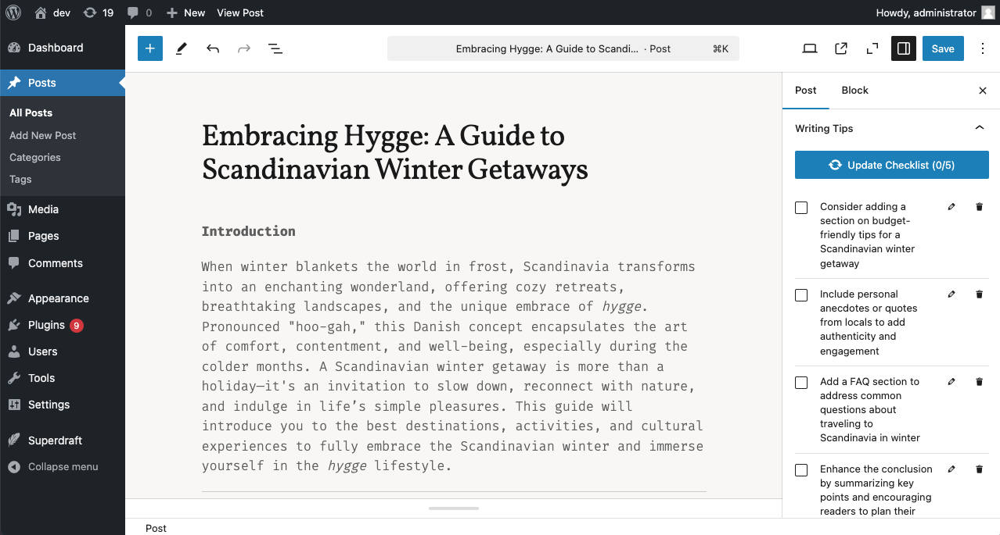

*Settings page for configuring the AI model and other options:*

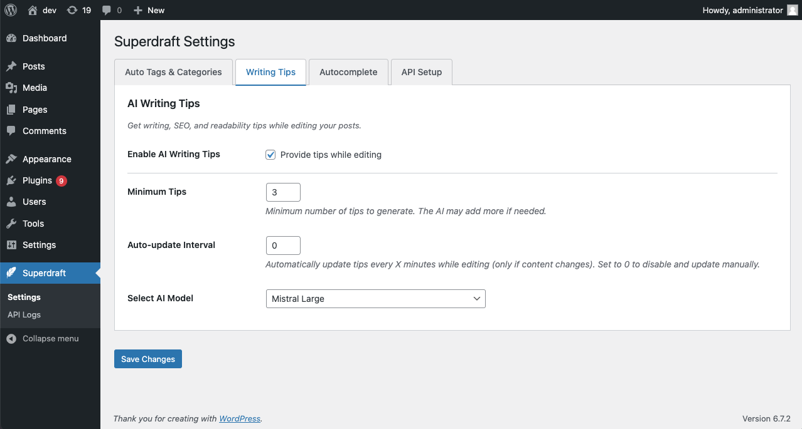

</details>

### AI Autocomplete

Context-aware text completion suggestions that appear in a dropdown, after typing a customizable trigger prefix. Features include:

- Customizable trigger prefix
- Number of suggestions to display
- Adjustable context length for better completions

<details>
<summary>View Screenshots</summary>

*AI autocomplete suggestions in the block editor:*

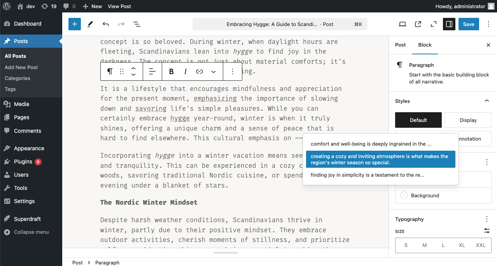

*Settings page for configuring the AI model and other options:*

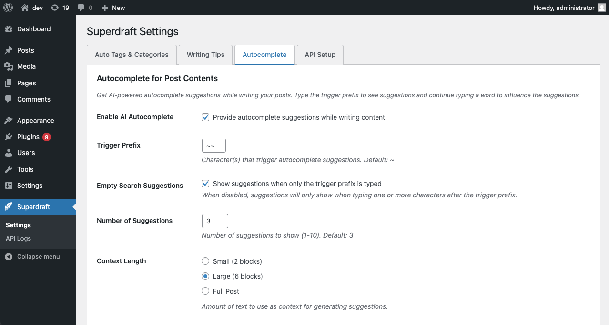

</details>

### Smart Compose

Inline sentence completion that works as you type, similar to Gmail's Smart Compose. Features include:

- Real-time context-aware completion suggestions that appear as you write
- Accept suggestions with Tab, right arrow key, or click
- Configurable delay to control suggestion timing
- Adjustable max_tokens value for shorter or longer completions
- Works with paragraph blocks in the editor

<details>
<summary>View Screenshot</summary>

*Inline sentence completion in the block editor:*

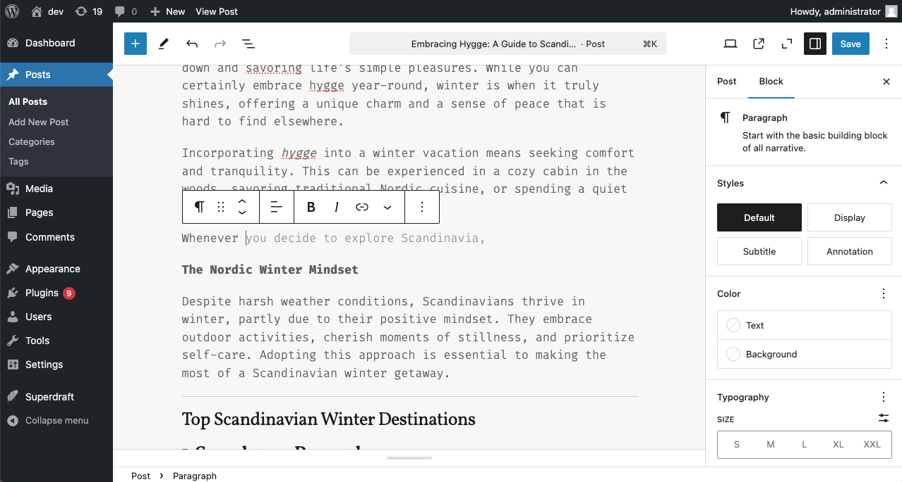

</details>

### Image Generation & Editing

Generate and edit featured images directly in the post editor using AI. Features include:

- Text-to-image generation with customizable prompts
- Smart prompt generation based on post title and content
- Targeted image editing capabilities:
  - Modify specific areas or objects in the image
  - Adjust style, lighting, and composition
  - Regenerate portions while keeping others intact
- Seamless integration with WordPress media library

<details>
<summary>View Screenshot</summary>

*Image generation and editing interface in the post editor:*

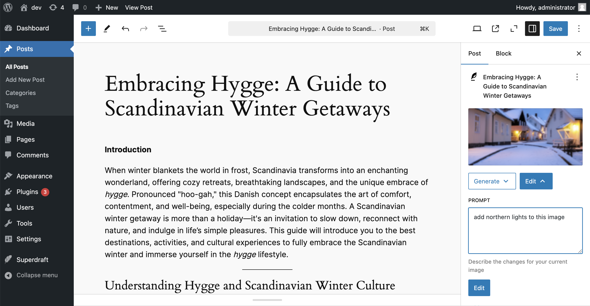

</details>

## Advanced Configuration

### Logging Features
- Track API usage across different models
- Check tool usage statistics
- View input/output token counts
- Monitor and filter logs

<details>
<summary>View Screenshot</summary>

*Logging Interface:*

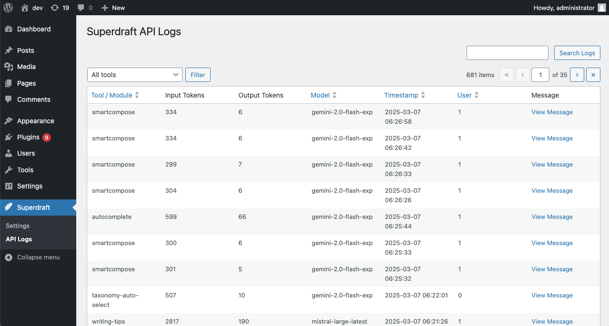

</details>

### Constants
- `SUPERDRAFT_LOG_PROMPTS`: Enable logging of all AI prompts as messages
- `SUPERDRAFT_LOG_RESPONSES`: Enable logging of all AI responses as messages

When enabled, the log messages can be viewed in the plugin's logging interface. Additionally, you can customize the log output through the provided filters.

For example, to enable logging of all AI prompts and responses, add the following code to your `wp-config.php` file:

```php
define( 'SUPERDRAFT_LOG_PROMPTS', true );
define( 'SUPERDRAFT_LOG_RESPONSES', true );
```

<details>
<summary>View Screenshot</summary>

*Log Messages:*

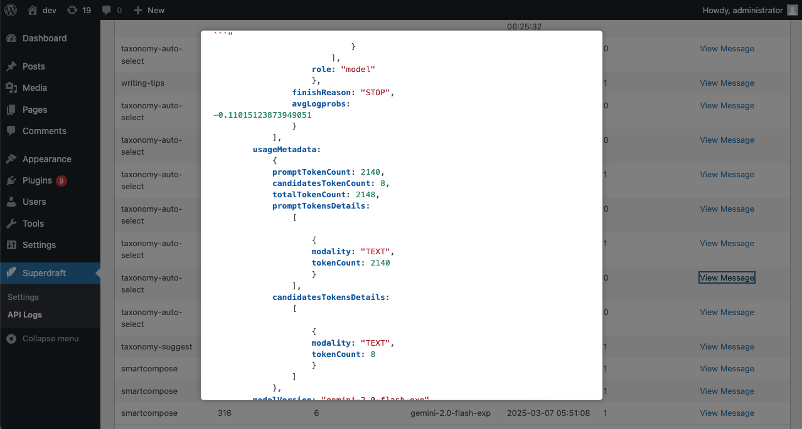

</details>

### Clean, Customizable Prompts
Superdraft comes with easy-to-understand AI prompt templates that you can customize to suit your needs. Prompts are stored as text files in the `prompts` directory and can be easily overridden in your theme or child theme, or by using a custom plugin.

Prompts, like the rest of the plugin, are fully translatable and can be customized to suit your needs. Superdraft will automatically load the correct prompt based on your site's language settings and the available prompt files. Currently, the plugin ships with English and Hungarian prompts.

#### Custom Prompt Templates

You can find the following prompt templates in the `prompts` directory:
- `add-terms.txt`: Suggestions for adding new tags and categories based on the content of your recent posts
- `assign-terms.txt`: Suggestions for assigning tags and categories to your posts based on their content
- `autocomplete.txt`: Suggestions for text completion in the block editor based on the context around the cursor
- `smartcompose.txt`: Suggestions for inline sentence completion in the block editor based on the context before the cursor
- `writing-tips.txt`: Writing tips and content improvement suggestions

To override the default prompts, copy the desired prompt file to your theme or child theme's `superdraft` directory. Superdraft will automatically load the custom prompt file if it exists. Optionally, you can use the `superdraft_prompt_directories` filter to add additional directories to search for prompt files, or use the other prompt-related filters to customize the prompt loading process (see the code examples below).

```php
// Add a custom prompts folder.
add_filter( 'superdraft_prompt_directories', function( $directories ) {
    // Append your custom directory (adjust the path as needed).
    $directories[] = WP_PLUGIN_DIR . '/my-plugin/prompts';
    return $directories;
});
```

With the above code, Superdraft will search for prompt files in the following directories:
- `/wp-content/plugins/my-plugin/prompts` (custom directory)
- `/wp-content/themes/your-child-theme/superdraft`
- `/wp-content/themes/your-theme/superdraft`
- `/wp-content/plugins/superdraft/prompts`

#### Prompt Template Syntax

Superdraft prompt templates use a simple syntax for variable placeholders and conditional blocks. Variables are enclosed in double curly braces (`{{variable}}`), while conditional blocks are enclosed in double parentheses with a question mark: (`((?conditional text with a {{variable}}))`). Conditional blocks are removed if all variables inside them evaluate to false (e.g. empty strings).

### Action and Filter Hooks
Superdraft provides a variety of hooks for developers to customize the plugin's behavior. These hooks allow you to modify the AI models, adjust the plugin's settings, and extend its functionality.

#### Filters

* `superdraft_log_data`
Filter the data to be logged, allowing you to modify the logging information.
Parameters:
```
$data (array) – The data to be logged.
$api (object) – The API object.
```

* `superdraft_api_request_body`
Customize the body payload sent to the AI API.
Parameters:
```
$body (array) – The request body.
$this (object) – The current instance of the API class.
```

* `superdraft_api_request_headers`
Modify the headers used in the request to the AI API.
Parameters:
```
$headers (array) – The request headers.
$this (object) – The current instance of the API class.
```

* `superdraft_prompt_directories`
Alter or add directories to search for prompt template files.
Parameters:
```
$prompt_directories (array) – Array of prompt directory paths.
```

* `superdraft_prompt_template`
Override the default prompt template name used by the plugin.
Parameters:
```
$template (string) – The current prompt template filename.
```

* `superdraft_pre_prompt_text`
Short-circuit prompt file reading by providing custom prompt text directly.
Parameters:
```
$contents (string) – The prompt text (empty by default).
$template (string) – The prompt template filename.
```

* `superdraft_prompt_vars`
Change the key/value pairs that are passed into the prompt template.
Parameters:
```
$vars (array) – The prompt variables as key => value pairs.
$prompt (string) – The prompt template filename.
```

* `superdraft_bulk_process_interval`
Filter the interval between bulk process actions, allowing you to adjust the wait time between operations. By default, the interval is set to 60 seconds.
Parameters:
```
$interval (int) – The current interval in seconds.
$action (string) – The name of the bulk action being processed.
$post_ids (array) – An array of post IDs involved in the bulk process.
```

* `superdraft_models`
Filter the list of available AI models, allowing you to add or modify the models that can be used with the plugin.
Parameters:
```
$models (array) – The list of available AI models.
```

#### Action Hooks

* `superdraft_bulk_process_completed`
Triggered when a bulk process is completed, so you can execute additional custom actions.

### Custom AI Models
Superdraft supports custom models: you can plug in any OpenAI-compatible API by providing the endpoint URL, model name, and API key. This feature allows you to use any model you have access to, including locally hosted models, or custom models you've trained yourself.

## Requirements

- WordPress 6.0 or higher
- PHP 7.4 or higher
- API key from supported AI providers (OpenAI, Google AI, etc.)

## Contributing

Contributions are welcome! Please feel free to submit issues or pull requests.

### JS Build Process

The JavaScript source files (located in the `src/` folder) are processed using Webpack. The build process starts from the entry points defined in `webpack.config.js` (e.g., `autocomplete.js`, `smartcompose.js`, etc.). This configuration is based on the default settings provided by the `@wordpress/scripts` package. A small adjustment is made to remove the Dependency Extraction plugin, ensuring that external dependencies (like various WordPress packages) remain external. The bundled, production-ready files are output to `/assets/admin/js/dist`, ready for use by the plugin.

## License

Superdraft is licensed under the GPL-3.0 License.
